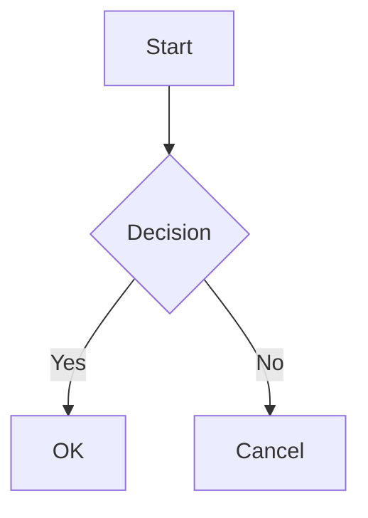

# create-slides-app

Turn any Markdown file into a ready-to-present slide app.

- One command to scaffold, run, build, or export
- 55 built-in themes, bundled in one universal template
- Presenter mode, syntax highlighting, math, Mermaid, PDF export, and MP4 export

Good fit for people who want something simpler than wiring reveal.js by hand, but more app-like than a single static deck file.

## Quick start

```bash
npx create-slides-app slides.md
```

If the Markdown file does not exist, a sample deck is created automatically. Dependencies are installed into `themes/<theme>/`, a dev server starts, and the browser opens. Running the same command again on the same file reuses the same theme runtime under `themes/`.

Choose a specific theme:

```bash
npx create-slides-app deck.md --theme academic
```

Build static HTML:

```bash
npx create-slides-app deck.md --build
```

Export to PDF (requires Google Chrome):

```bash
npx create-slides-app deck.md --export pdf
```

Export to MP4 video with fade transitions (requires Google Chrome and ffmpeg):

```bash
npx create-slides-app deck.md --export mp4
```

## CLI options

```
create-slides-app [slides.md] [--theme <name>]
create-slides-app [slides.md] --build
create-slides-app [slides.md] --export <pdf|mp4>
create-slides-app [project-name] [--theme <name>]
```

- `slides.md` -- Markdown file to use. Created if it does not exist. The source file stays where it is, and the generated runtime lives under `themes/<theme>/`.
- `project-name` -- Output directory name when no Markdown file is given.
- `--theme <name>` -- Theme name written to frontmatter. Prompted interactively if omitted.
- `--template <name>` -- Deprecated alias for `--theme`.
- `--build` -- Build static HTML to `dist/` without starting a dev server.
- `--export pdf` -- Export slides to PDF. Requires Google Chrome.
- `--export mp4` -- Export slides to MP4 with fade transitions. Requires Google Chrome and ffmpeg.
- `--build` and `--export` cannot be used together.

When you run `create-slides-app deck.md --theme academic`, the directory layout looks like this:

```text
.
├── deck.md
└── themes
    └── academic
```

The shared runtime under `themes/academic/` reads `deck.md` directly. It does not create a second visible copy such as `deck/deck.md`.

## Markdown features

Slides are separated by `---`. Frontmatter sets the title and theme.

### Basic structure

```md
---
title: My Talk
theme: reveal.js-black
---

# First Slide

Welcome to the presentation.

---

# Second Slide

- Point one
- Point two
```

### Syntax highlighting

Fenced code blocks are highlighted with Shiki (vitesse-dark theme). All languages supported by Shiki work.

````md
```typescript
function greet(name: string): string {
  return `Hello, ${name}!`;
}
```
````

### Math (KaTeX)

Inline math uses single dollar signs, block math uses double dollar signs.

```md
Inline: $E = mc^2$

$$
\int_0^\infty e^{-x^2} dx = \frac{\sqrt{\pi}}{2}
$$
```

### Mermaid diagrams

Fenced code blocks with `mermaid` language render as SVG diagrams.

````md

````

### Slide layouts

Use `<!-- layout: title -->` to switch a slide to the title layout (centered, larger heading). Without the directive, slides use the default layout (left-aligned content).

```md
<!-- layout: title -->

# My Presentation

A subtitle or tagline

---

# Regular Slide

This uses the default left-aligned layout.
```

Available layouts: `title`, `default` (implicit).

### Fragment lists

Add `<!-- fragment -->` before a list to reveal items one at a time with arrow keys.

```md
<!-- fragment -->

- First point
- Second point
- Third point
```

### Speaker notes

Content below a `Note:` or `Notes:` line is hidden from the slide and shown only in presenter mode.

```md
# My Slide

Visible content here.

Note:
This text is only visible in the presenter window.
Press P to open it.
```

### Feature summary

- Slide layouts -- `<!-- layout: title -->` for centered title slides, default for content slides
- Syntax highlighting -- Fenced code blocks highlighted via Shiki (vitesse-dark theme)
- Math -- Inline (`$...$`) and block (`$$...$$`) math rendered with KaTeX
- Mermaid diagrams -- Fenced code blocks with `mermaid` language render as SVG
- Fragment lists -- `<!-- fragment -->` before a list reveals items one by one
- Speaker notes -- `Note:` line separates visible content from presenter-only notes
- Presenter mode -- Press `P` to open a window with notes, next slide preview, and elapsed timer
- 16:9 aspect ratio -- Slides are fixed at 1280x720 and scale to fit the viewport

## Keyboard shortcuts

| Key                   | Action                     |
| --------------------- | -------------------------- |
| Right / Down / Space  | Next slide or fragment     |
| Left / Up / Backspace | Previous slide or fragment |
| Home                  | First slide                |
| End                   | Last slide                 |
| P                     | Open presenter window      |

## Available themes

Themes are listed in `templates/default/themes.json`. The repository currently ships 55 themes:

- reveal.js adapted: `reveal.js-black`, `reveal.js-white`, `reveal.js-league`, `reveal.js-beige`, `reveal.js-sky`, `reveal.js-night`, `reveal.js-serif`, `reveal.js-simple`, `reveal.js-solarized`, `reveal.js-blood`, `reveal.js-moon`, `reveal.js-dracula`, `reveal.js-black-contrast`, `reveal.js-white-contrast`
- external adapted: `academic`, `border`, `bw`, `catppuccin-frappe`, `catppuccin-latte`, `colors-blue`, `colors-green`, `colors-orange`, `colors-pink`, `colors-purple`, `colors-red`, `cybertopia`, `dracula-marp`, `gradient`, `graph-paper`, `hull-blue`, `indie-gaia`, `marpx-cantor`, `marpx-church`, `marpx-copernicus`, `marpx-einstein`, `marpx-frankfurt`, `marpx-galileo`, `marpx-gauss`, `marpx-goedel`, `marpx-gropius`, `marpx-haskell`, `marpx-hobbes`, `marpx-lorca`, `marpx-newton`, `marpx-socrates`, `marpx-sparta`, `olive`, `olive-gold`, `olive-invert`, `robot-lung`, `rose-pine`, `rose-pine-dawn`, `rose-pine-moon`, `sunblind`, `wave`

The universal template includes `THIRD_PARTY_NOTICES.md` with attribution for the bundled upstream themes.

## Tech stack

- React + Vite + TypeScript
- unified / remark / rehype pipeline for Markdown processing
- Shiki for syntax highlighting
- KaTeX for math rendering
- Mermaid for diagrams

## Development

```bash
npm install
npm run generate:templates
npm run check
npm run build
npm run smoke
```

`npm run check` runs the CLI build, smoke test, template structure validation, and a universal template build.

Universal template development:

```bash
cd templates/default
npm install
npm run dev
```

`templates/default` is the runtime template shipped by the CLI. `npm run generate:templates` refreshes its bundled theme CSS from the reveal.js vendor files and the curated external theme definitions.

## CI

GitHub Actions runs `npm ci` followed by `npm run check` (CLI build, smoke test, template validation, universal template build).
