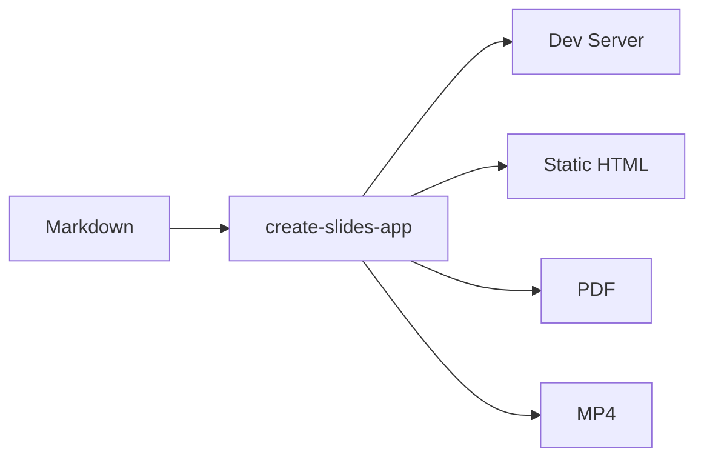

# Reveal.js Simple

Theme: reveal.js-simple

---

# Syntax Highlighting

```typescript
interface Slide {
  title: string;
  content: string;
  notes?: string;
}

function present(slides: Slide[]): void {
  for (const slide of slides) {
    render(slide);
  }
}
```

---

# Math

Inline math: $E = mc^2$

Block math:

$$
\sum_{k=1}^{n} k = \frac{n(n+1)}{2}
$$

---

# Diagrams



---

# Step-by-step Reveal

<!-- fragment -->

- Write your slides in Markdown
- Run a single command
- Present in the browser

---

# Get Started

Edit this file and start presenting

Note:
Speaker notes are visible only in presenter mode.
Press P to open the presenter window.
