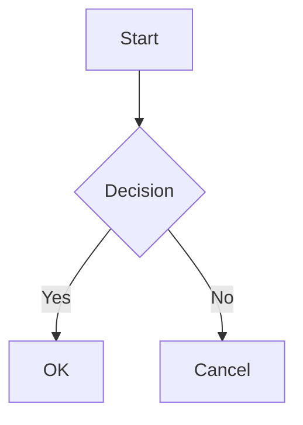

# Feature Test

All features demo

---

# Syntax Highlighting

```typescript
interface User {
  name: string;
  age: number;
}

function greet(user: User): string {
  return `Hello, ${user.name}!`;
}
```

---

# Math (KaTeX)

Inline math: $E = mc^2$

Block math:

$$
\int_0^\infty e^{-x^2} dx = \frac{\sqrt{\pi}}{2}
$$

---

# Mermaid Diagram



---

# Fragment List

<!-- fragment -->

- First item appears
- Second item appears
- Third item appears

---

# Speaker Notes

This slide has notes for the presenter.

Note:
Remember to explain the architecture here.
This is only visible in presenter mode (press P).
